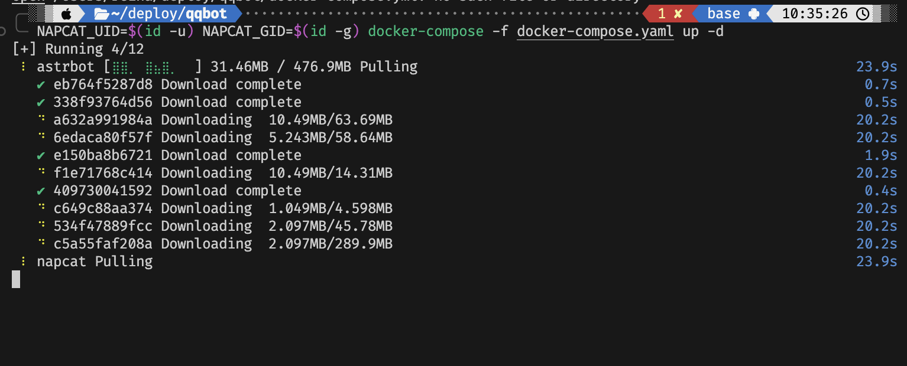
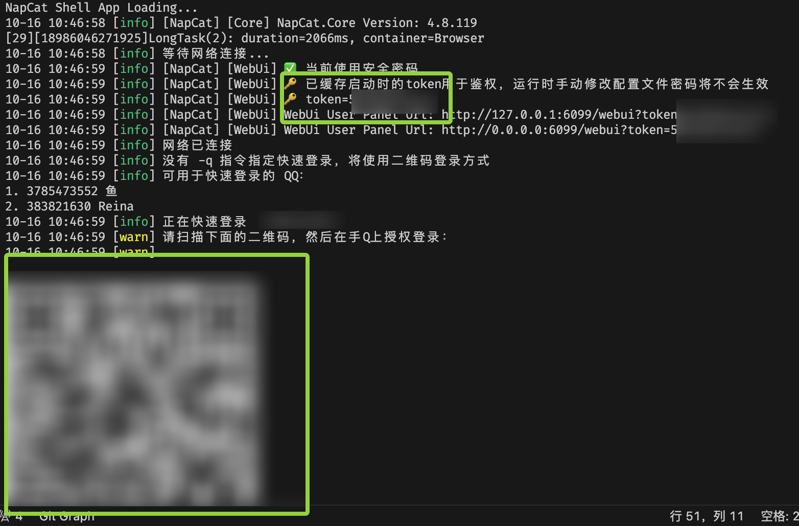
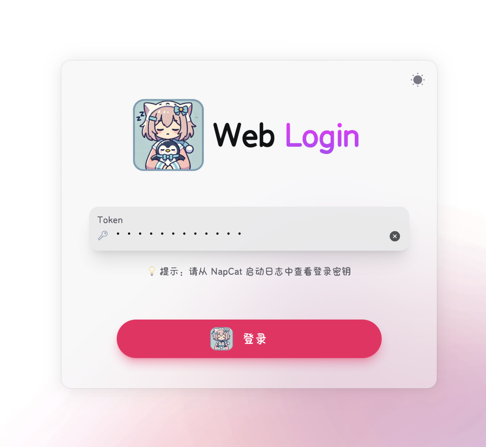
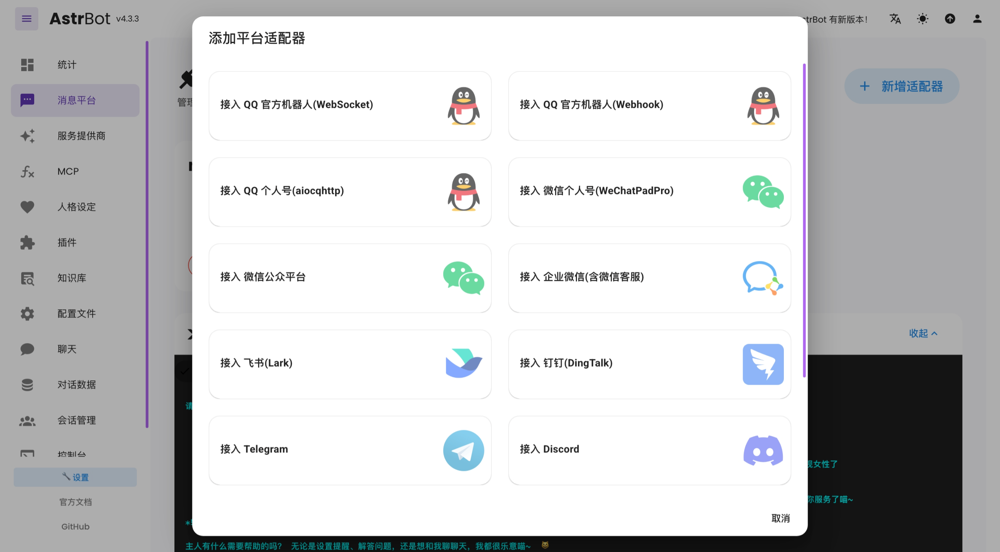
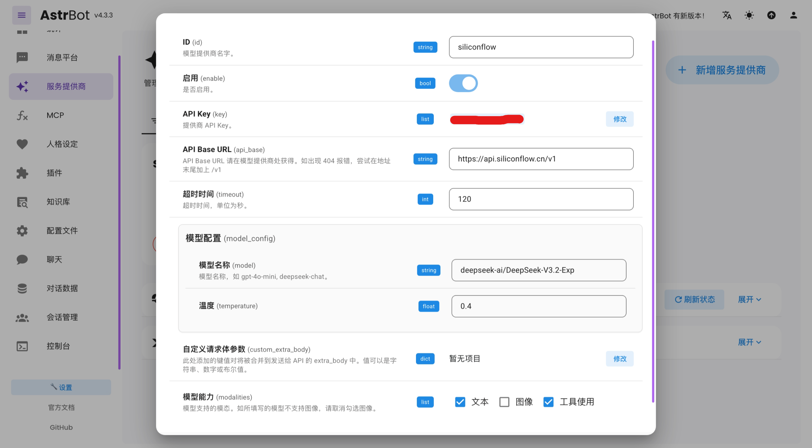

import Image from '@theme/components/Image.astro';

# 使用 NapCat 和 Astrbot 部署 QQ 机器人

## 基本介绍

### Onebot 协议

Onebot 是一个开放的机器人协议，旨在为各种聊天平台提供统一的接口。它定义了一套标准的 API，使得开发者可以编写一次代码，然后在多个平台上运行（例如 QQ、Telegram），而无需针对每个平台进行单独的适配。

### NapCat

NapCat 的主要职责是处理与 QQ 服务器的底层通信，确保机器人账号的稳定在线和消息的可靠传递。它通过启动一个无界面的 QQ 客户端实例来工作，从而使机器人能够在服务器等环境中7x24小时运行。

你可以将其理解为一个功能强大的“中间件”，它将 QQ 的原生通信协议转换成开发人员更容易使用的标准化接口（遵循 OneBot 协议）。


### Astrbot

AstrBot 则是一个开源的、一站式的 Agentic 聊天机器人平台及开发框架。它的定位是上层应用框架，让开发者可以轻松地在包括 QQ、微信、Telegram、Discord 在内的多种消息平台上，部署和开发支持大型语言模型（LLM）的智能聊天机器人。

AstrBot 的核心优势在于其强大的整合能力和丰富的功能，包括：
- 多平台支持：一套核心逻辑，可以适配多个聊天软件。
- 大模型接入：轻松集成 OpenAI、DeepSeek、Gemini、Ollama 等多种主流大语言模型，赋予机器人强大的对话和理解能力。
- 可视化管理：提供 WebUI 管理后台，方便用户进行配置和管理。
- 插件化架构：拥有灵活的插件系统，便于扩展机器人的功能，例如知识库问答、角色扮演、群聊管理等。

### 关系

简而言之，Napcat 负责与 QQ 服务器的底层通信，而 AstrBot 则利用 NapCat 提供的接口，实现更高层次的智能聊天功能。两者结合，使得开发者能够快速构建功能丰富、智能化的 QQ 机器人。


## 部署流程

### 基础设施

你需要有一台 24h 工作的服务器（无论是否连入公网），因为你的服务需要一直在跑。

个人的服务器是当初买的腾讯云的轻量应用服务器，最低配的都行。

使用 VS Code 远程连接到服务器上，可以动态的转发端口，方便调试

### Docker 部署

一般你的服务器 / Linux 系统中都有 Docker 配置，我们这里使用 Docker-Compose 来部署。

部署其实非常简单，直接复制 [NapNeko/NapCat-Docker/astrbot.yml](https://github.com/NapNeko/NapCat-Docker/blob/main/compose/astrbot.yml) 文件到你的服务器上，不需要做任何修改。

该文件内容如下

```yaml
# docker-compose.yml
# NAPCAT_UID=$(id -u) NAPCAT_GID=$(id -g) docker-compose -f ./compose/astrbot.yml up -d
services:
  napcat:
    environment:
      - NAPCAT_UID=${NAPCAT_UID:-1000}
      - NAPCAT_GID=${NAPCAT_GID:-1000}
      - MODE=astrbot
    ports:
      - 6099:6099
    container_name: napcat
    restart: always
    image: mlikiowa/napcat-docker:latest
    volumes:
      - ./data:/AstrBot/data
      - ./napcat/config:/app/napcat/config
      - ./ntqq:/app/.config/QQ
    networks:
      - astrbot_network
    #mac_address: "02:42:ac:11:00:02"
  astrbot:
    environment:
      - TZ=Asia/Shanghai
    image: soulter/astrbot:latest
    container_name: astrbot
    restart: always
    ports:
      - "6185:6185"
      #- "6195:6195"
      #- "6199:6199"
    volumes:
      - ./data:/AstrBot/data
    networks:
      - astrbot_network
networks:
  astrbot_network:
    driver: bridge
```

将这个文件放到你想要部署的某个目录下，假设该文件名为 `docker-compose.yml`，然后执行

```bash
NAPCAT_UID=$(id -u) NAPCAT_GID=$(id -g) docker-compose -f ./docker-compose.yml up -d
# 前面的 NAPCAT_UID 和 NAPCAT_GID 是为了让 NapCat 以当前用户的权限运行，避免权限问题
# 其实 sudo docker-compose -f ./docker-compose.yml up -d 也行？
```


过一会儿，执行 `docker ps`，你就能看到两个容器都在运行了。

### 登陆 NapCat

有两种方式

#### Docker logs 终端二维码

执行 `docker logs napcat`，你会看到类似下面的输出



然后你就可以用手机 QQ 扫码登录了。

#### WebUI 登陆

浏览器打开 `http://<server-ip>:6099`（如果你是在本地运行的，或者使用 ssh 端口转发了，就可以直接访问 `http://localhost:6099`）



输入上文的token，登录之后

然后同样有一个 QQ 登陆的界面.

---

至此，你的 NapCat 就已经成功登录了。后面基本不用配置了。


### 配置 AstrBot

浏览器打开 `http://<server-ip>:6185`（如果你是在本地运行的，或者使用 ssh 端口转发了，就可以直接访问 `http://localhost:6185`）

默认用户名密码都是 `astrbot`，登陆后可以修改密码

#### 添加平台适配器

在 "消息平台" 页面，点击 "新增适配器"，选择 "aiocpqhttp" 适配器，这个适配器是用来连接 NapCat 的。



配置只需要调成 "启用" 以及把 WebSocket 端口改成 6199（NapCat 的 WebSocket 端口，在 NapCat 的网络配置里可以看到）

#### 添加大语言模型


在 "大语言模型" 页面，点击 "新增模型"，选择你想要使用的模型，例如 OpenAI。

个人使用的是 [硅基流动](https://cloud.siliconflow.com) 的模型，但是踩了一个坑，有些模型是没法用的，具体哪些我不知道。但是 `Qwen/Qwen3-VL-30B-A3B-Instruct` 确实是不可以，当时困惑了我很久。



#### 其余配置

在配置文件里可以配置一些全局的参数，例如：
- 启用大语言模型聊天
- 现实世界时间感知
- 启用分段回复
...


